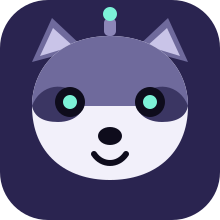
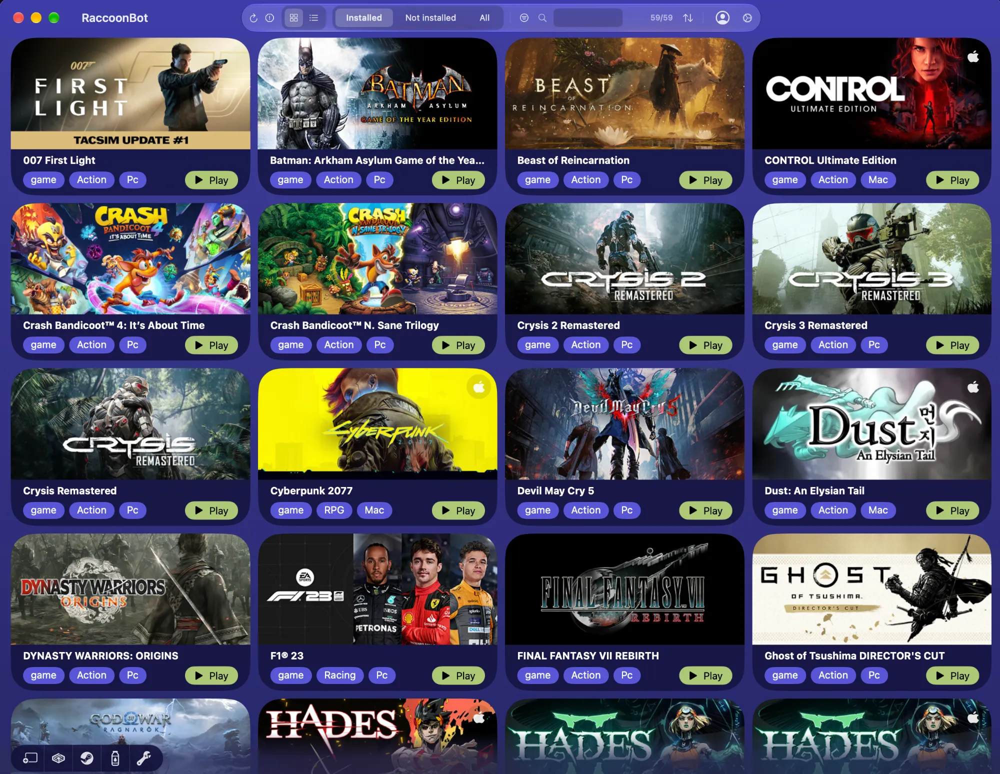
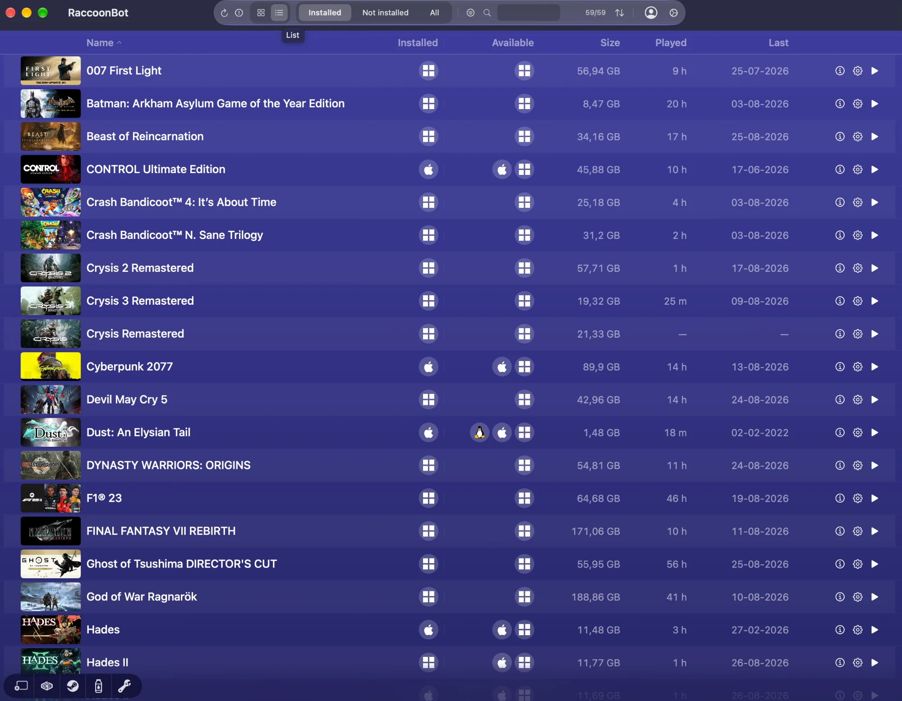
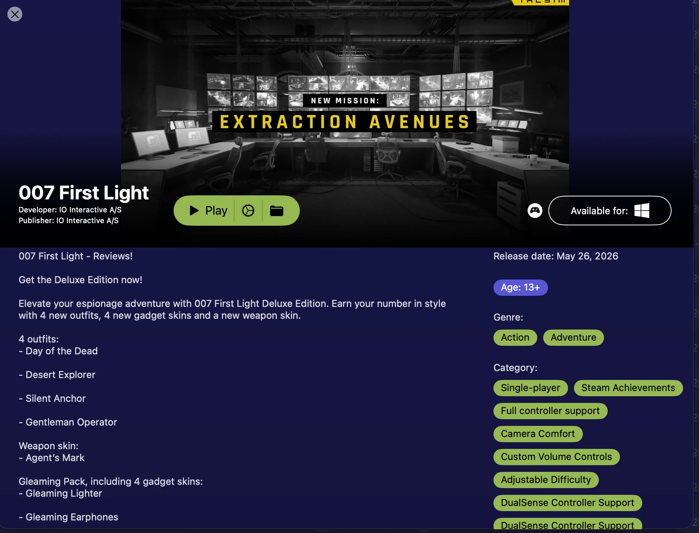
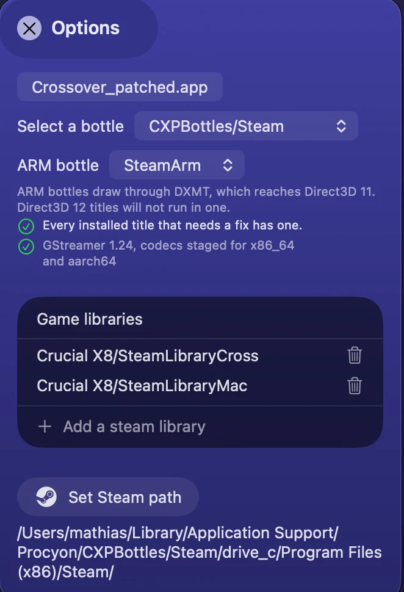
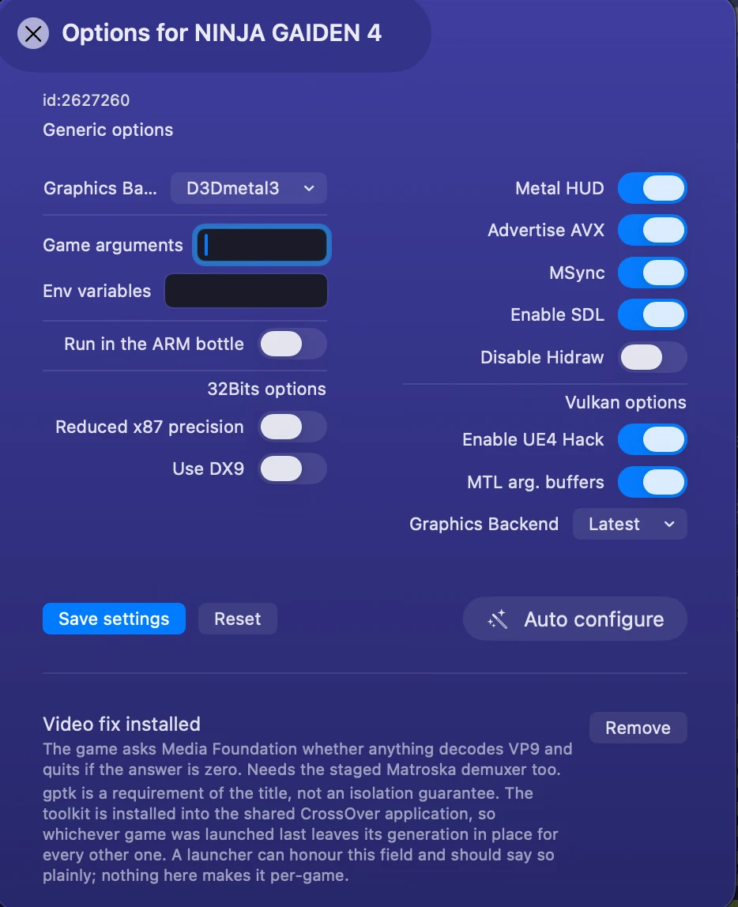

<div align="center">



# RaccoonBot

**A launcher for macOS that runs your Steam and Epic Games Store libraries
through CrossOver — and fixes the ones whose cutscenes do not play.**

</div>

> **RaccoonBot is not a replacement for anything. It needs CrossOver, and it
> needs it installed and licensed by you.**
>
> It is an enhancement layer on two other projects: it will not run a single
> game without [CrossOver](https://www.codeweavers.com/crossover), and its
> entire interface is [Procyon](https://github.com/italomandara/Procyon). What
> RaccoonBot adds is the video layer on top.

CrossOver, by CodeWeavers, is what actually runs the games — it is a commercial
Wine distribution, you buy it, and RaccoonBot neither includes nor replaces it.

Procyon, by Italo Mandara, is the launcher: the library, the bottle handling,
the per-game options, the CrossOver patching, the whole interface you see in the
screenshots below. RaccoonBot is a fork of it.

What RaccoonBot adds is one thing: a video-decoding layer and a catalogue of
per-title fixes, for games that install correctly under CrossOver and then show
a black screen, a green screen, or exit when the first cutscene starts. If your
games already play their cutscenes, you want Procyon, not this.

---

## What it does

**Runs your Steam library.** Windows titles through a patched copy of CrossOver,
macOS titles natively. It reads Steam's own files on disk, so the library is
drawn before it asks the network for anything — and stays drawn if the network
never answers.

**Patches CrossOver for you.** It copies your CrossOver into a separate
application and adds DXMT, an updated MoltenVK, and Apple's Game Porting Toolkit
(D3DMetal). Your original CrossOver is not modified.

**Fixes cutscenes.** This is the part that is not in Procyon. Many Windows games
run fine under CrossOver until a video starts: Wine's media pipeline has no
decoder for the format, and the game either plays audio over a blank picture or
exits. RaccoonBot copies the missing decoder into your patched CrossOver and
applies per-title fixes where a decoder alone is not enough.

**Installs what is missing.** It says whether an engine has the decoders it
needs, and it can apply every fix your library needs in one pass.

**Tells you before you are surprised.** A title that needs its fix is marked in
the library and warned about *before* it launches, not after the cutscene fails.

---

## Requirements

| | |
|---|---|
| macOS | **15 or later**, Apple Silicon. The build targets `arm64` only |
| [CrossOver](https://www.codeweavers.com/crossover) | 26.x or 27.x. You buy and install it yourself; RaccoonBot does not include it |
| ~~GStreamer~~ | **No longer required.** Until 0.2.0 the decoders were taken from a GStreamer the user had to install. They travel inside RaccoonBot now, so there is nothing to install and nothing to keep at a particular version |
| Steam | Installed inside a RaccoonBot bottle, and signed in |

D3DMetal and the Wine components for the 32-bit path come with RaccoonBot and
are copied into the patched CrossOver for you, so there is nothing else to find
or download.

---

## Installing RaccoonBot

Download the `.app` from
[Releases](https://github.com/MathiasKowoll/RaccoonBot/releases), move it to
`/Applications`, and open it.

**macOS will refuse the first time.** RaccoonBot is signed ad-hoc and is not
notarised, so Gatekeeper blocks it. This is expected and the fix takes ten
seconds — see [the FAQ](#macos-says-raccoonbot-cannot-be-opened) below.

---

## Using it

### The library



Three tabs:

- **Installed** — what you can play right now
- **Not installed** — everything else Steam knows you have, with an Install
  button that hands the job to Steam's own dialog
- **All** — both at once

Two views, and the choice is remembered. The **list** is the one above: sortable
by name, platform, size, hours played and when you last played. The **grid**
shows cover art. `Installed` is the platform a title is installed *as*;
`Available` is what it ships *for* — a game can offer three and be installed as
one.



Search filters the list you are looking at, and the count beside the field tells
you how much of it you are seeing.

### A game's page



Click a cover or a row and you get the store page for that title — description,
genres, release date, and what it is available for. From here you can play it,
open its options, or reveal its folder. For a title you have not installed, the
same page appears with an Install button instead.

### Settings



This is where you point RaccoonBot at CrossOver, choose a bottle, see whether an
engine has its decoders, and install the controller set. **Patch all** applies
every fix your installed library needs in one pass — it checks each title is really there
first, and skips anything you have chosen to leave alone.

> **RaccoonBot keeps its own bottles.** They live in
> `~/Library/Application Support/RaccoonBot/CXPBottles`, which is not where
> CrossOver keeps its own. If you already use CrossOver, its bottles will not
> appear in this list and RaccoonBot will not write into them — including the
> line that points a bottle at the decoders. Install Steam into a bottle you
> create here.

### Per-game options



Every title carries its own graphics backend, environment variables and launch
options. **Auto configure** installs that title's fix and sets the options it is
known to need, in one action.

---

## The fixes

RaccoonBot carries [MacGameVideoFix](https://github.com/MathiasKowoll/MacGameVideoFix)
**inside the application** and runs it from there — a catalogue of currently
**19 titles** across **12 installers**. Nothing is downloaded at run time.

It used to be fetched, and being bundled is the point of the change: two copies
that can silently disagree is worse than one copy that ships with the
application. A fix now needs a new release, and in exchange what you have is
what was tested.

### The codecs

Wine's `winegstreamer` asks GStreamer to decode a game's video, and CrossOver
ships everything it needs except one plugin: **`libgstlibav`**, which is where
VC-1, WMV, WMA and software VP9 come from. Without it those cutscenes play their
sound over a blank picture.

RaccoonBot **carries twelve files itself** — three plugins and the nine
libraries they need — and copies them into the patched CrossOver while it is
patching it. Each is verified against a recorded sha256 before it goes in, and
anything already there is kept as `.orig`, so the engine can be put back.

They were taken out of a user's own GStreamer install until 0.2.0. Shipping them
makes this application a redistributor of other people's LGPL and BSD binaries,
which is a real obligation and not a formality: `CODEC-LICENCES.md` travels with
them, names every file, gives its hash and says where the corresponding source
is. Read it before passing these on.

Inside the engine rather than beside it, on purpose. The plugin then binds to
the GStreamer that engine already carries, and there is never a second core in
the process — which is the crash this whole arrangement exists to avoid.

Nothing is copied that the engine already has.

### What the per-title fixes actually do

The catalogue covers four distinct failures. They are different problems and the
fixes are not interchangeable:

- **No decoder.** *Nioh*, *Nioh 2*, *Nioh 3*, *Persona 5 Strikers*, *Devil May
  Cry 5* — the cutscene runs with sound and no picture. The decoder in the
  engine is the whole fix for these; nothing is installed in the game folder.
- **Media Foundation reports nothing.** *NINJA GAIDEN 4* asks the system what
  can decode VP9, is told nothing can, and exits. It needs the decoder count to
  be answered honestly.
- **Direct3D interfaces D3DMetal lacks.** *DYNASTY WARRIORS: ORIGINS*, *Wo Long:
  Fallen Dynasty*, *Mortal Shell 2*, *Beast of Reincarnation*, the *Life is
  Strange* titles — a bridge library stands in for the calls the player makes.
- **Not about video at all.** *TMNT: Splintered Fate* and *Tormented Souls 2*
  each make one D3D12 call that ends the process; the fix guards that call.

*KINGDOM HEARTS* is its own case: cutscenes play with sound over a solid green
picture, because the luma and chroma planes are handled separately.

---

## Controllers

A PlayStation pad under CrossOver used to be unpredictable. By cable a DualSense
rumbled; by Bluetooth it depended on the title — some rumbled, some did not, the
adaptive triggers were the same lottery, and the PS button and the touchpad could
go quiet as well.
It is none of the things people blame — the pad speaks a different protocol on
each transport and **silently ignores the wrong one**, and nothing under Wine
ever told Windows which transport it was on.

RaccoonBot installs an engine set that does, from **Options**. With it a pad
behaves like a PlayStation pad on either transport: PlayStation glyphs,
touchpad, PS button, adaptive triggers and rumble. The pad is never replaced,
wrapped or hidden — it keeps its own report descriptor — so nothing that read it
before reads anything different now.

**And rumble in games that have never heard of a DualSense.** Most Windows games
ask XInput for "controller 1" and expect an Xbox pad; XInput had no motors to
offer, because a DualSense does not keep its motors where an Xbox pad does. The
set offers them, and it costs nothing in frames: a Bluetooth link to a pad
carries about sixty-five reports a second, so instead of adding packets the
motors ride inside one the game is already sending. It is **per title**, in the
game's options panel, because a game that drives the pad itself does not need it.

The same panel carries the rest per title: which of the pad's two vibration
paths to ask for — **Modern**, the pad's own, finer; or **Legacy**, an imitation
of rotating-mass motors, harder at the same command — a strength for each, and a
HID trace for anyone reporting a controller problem.

The engine patches, what each one is for and what was measured on it are in
[MacGameVideoFix](https://github.com/MathiasKowoll/MacGameVideoFix), and the
same set is published on its own as
[MacGamePadFix](https://github.com/MathiasKowoll/MacGamePadFix) for people who
want the controller half and nothing else.

> Everything above was measured on one machine, with a DualSense and a DualSense
> Edge. Which of the two vibration paths feels better is one person's hand with
> nothing instrumented, and it is written that way wherever it appears.

## FAQ

### macOS says RaccoonBot cannot be opened

Because it is not notarised. Apple charges for a developer account, and this is
a free project.

Nothing is wrong with the download — macOS refuses any application it cannot
trace to a paid Apple developer identity, whatever the application does. To open
it:

1. Try to open RaccoonBot once and dismiss the warning
2. **System Settings → Privacy & Security**
3. Scroll to Security. There is a line about RaccoonBot being blocked, and an
   **Open Anyway** button
4. Click it, then confirm

You only do this once. On older macOS versions, right-clicking the app and
choosing **Open** does the same thing; on recent versions it does not, and
System Settings is the only route.

If that makes you uncomfortable, the honest answer is to build it yourself —
`./build-local.sh` produces the same application from the source in this
repository, and an application you compiled needs no permission from anyone.

### Does it modify my CrossOver?

No. It copies CrossOver into a separate patched application and modifies the
copy. Your CrossOver keeps working exactly as it did, and you can delete the
patched copy at any time.

### Do I have to buy CrossOver?

Yes. It is commercial software from CodeWeavers and RaccoonBot does not include
it, replace it, or work without it.

### Do I have to install GStreamer separately?

**Not since 0.2.0.** You did: the decoder was taken from your own copy of the
framework while CrossOver was being patched, so you had to install it and keep
it at one exact version.

RaccoonBot carries the twelve files itself now — three plugins and the nine
libraries they need — and copies them into the engine while it patches it,
verifying each against a recorded hash first. Nothing reads
`/Library/Frameworks/GStreamer.framework` any more.

That makes this application a **redistributor of other people's LGPL and BSD
binaries**, which is an obligation rather than a formality. `CODEC-LICENCES.md`
travels with them, names every file, gives its hash, and says where the
corresponding source is.

### A game still shows a black screen

Open its options and check the fix is applied. If it is, the title may need a
decoder the engine does not carry, or a fix that does not exist yet — open an
issue with the game and what you see, and it can be looked at.

### Does it send my library anywhere?

Not as a library, no. It is read from Steam's and the Epic launcher's own files
on your disk, and no list of what you own is ever sent anywhere.

Three kinds of request leave the machine, all of them public and none of them
carrying a key, an account or a cookie:

- **Steam's public store endpoint**, for a Steam title's name and cover art.
- **Epic's public store-content endpoint**, for an Epic title's description,
  publisher, screenshots and requirements. The address is built from the
  title's own name, so the name of a game you own is what goes out, one title
  at a time, and the answer is cached so it is asked once.
- **GitHub**, for the fixes bundle.

It does not use the metadata proxy Procyon uses, and cannot: that is one
person's server and his quota.

### Will you upstream this to Procyon?

Some of it should be. `UPSTREAM.md` in this repository records which commits fix
bugs in Procyon itself and which are only ours. Nothing has been offered yet.

---

## Credits

RaccoonBot is a fork, and most of what it does was somebody else's work first.

### Procyon and CXPatcher

**[Italo Mandara](https://github.com/italomandara)** wrote
[Procyon](https://github.com/italomandara/Procyon), which is the launcher this
is built on — the library, the bottle handling, the per-game options, the whole
interface — and
[CXPatcher](https://github.com/italomandara/CXPatcher) before it, which is where
the CrossOver-patching approach comes from. Without those two this project would
not exist; it would be a shell script.

### WineVideo

**[Jfishin/winevideo](https://github.com/Jfishin/winevideo)** — "Drop-in
VP9/WebM video support + d3dmetal crash fix for CrossOver 26.2 (Apple Silicon)".
The same problem RaccoonBot's video layer exists to solve, solved first and
solved directly. Worth reading if you want the fix without a launcher around it.

### Carried over from Procyon's own credits

- **[@Lifeisawful](https://github.com/Lifeisawful)** — rosettax87, which is how
  32-bit titles run at a usable speed
- **[@Gcenx](https://github.com/Gcenx)** — patched Wine components and
  dxvk-macos
- **[@nastys](https://github.com/nastys)** — the UE4 MoltenVK hack

### The projects this stands on

None of these belong to RaccoonBot. It works because they exist.

- **[CrossOver](https://www.codeweavers.com/crossover)** — CodeWeavers. The Wine
  distribution that actually runs the games. Nothing here works without it, and
  it is worth paying for.
- **[Wine](https://www.winehq.org)** — decades of work by hundreds of people, and
  the reason any of this is possible at all.
- **[GStreamer](https://gstreamer.freedesktop.org)** and
  **[FFmpeg](https://ffmpeg.org)** — the decoders that turn a black screen back
  into a cutscene. The whole video layer is a thin arrangement of their work.
- **[DXMT](https://github.com/3Shain/dxmt)** — Direct3D 11 on Metal.
- **[MoltenVK](https://github.com/KhronosGroup/MoltenVK)** — Vulkan on Metal.
- **[Apple](https://developer.apple.com/games/game-porting-toolkit/)** — the Game
  Porting Toolkit and D3DMetal, and Metal underneath all of it.
- **[Valve](https://store.steampowered.com)** — Steam, whose local files are
  where RaccoonBot reads your library from.

Trademarks belong to their owners. RaccoonBot is not affiliated with, endorsed
by, or connected to CodeWeavers, Apple, Valve, or any game publisher named
anywhere in this repository.

---

## Building it

```bash
git clone https://github.com/MathiasKowoll/RaccoonBot.git
cd RaccoonBot
./build-local.sh
```

The application lands in `build/`. Signing is ad-hoc, so no Apple developer
account is needed to build or run your own copy.

A Debug build produces **RaccoonBot-Dev.app** with its own bundle identifier, so
it sits beside a stable copy rather than replacing it — and macOS cannot open
one thinking it is the other. The two share your bottles and your per-game
options; the view you were on and which titles you hid are per build.

Tests:

```bash
xcodebuild -project RaccoonBot.xcodeproj -scheme RaccoonBot -destination 'platform=macOS' test
```

---

## Licence

GPL-3.0-or-later. See [LICENSE.txt](LICENSE.txt).

Third-party attribution is in [CREDITS.md](CREDITS.md).
